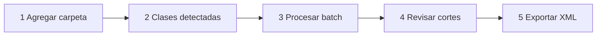

# Class Cut — Plan (app local para macOS)

App de escritorio **local para macOS (Apple Silicon nativo)** que procesa las grabaciones del Rodecaster Video **fuera del editor**: escanea el curso, transcribe el Live-Mix, alinea los marcadores con precisión (claqueta + texto de las notas), calcula los cortes con la lógica de The Cutter, aplica las vistas, y **genera XML universal (FCP7) que importa igual en Premiere Pro y DaVinci Resolve** — con las clases ya precortadas.

Principios: **no destructiva** (nunca toca el material original; todo se regenera), **autocontenida** (sin dependencias del sistema), **estable** (pipeline por etapas con artefactos inspeccionables + tests contra material real), **validable** (cada paso deja un XML importable para revisar en el NLE lo que generó), e **interfaz intuitiva** (flujo lineal de pasos, una acción principal por pantalla, estado visible por clase, lenguaje llano sin jerga técnica).

**Este documento es la especificación ejecutable**: al confirmar, se implementa por fases en orden (§9), cada una con sus criterios de aceptación. Los edge cases de §8 tienen comportamiento definido — no quedan a criterio del momento.

---

## 1. Contexto: qué produce el Rodecaster

Curso completo verificado en la copia local `~/Movies/CUR/2026_curso-spec-driven-development/` (espejo del SSD, sirve de fixture para desarrollo y tests): **3 días, 13 clases**.

```
2026_curso-spec-driven-development/
├── Day_1 RODECASTER_Video/        ← Clases 01–04
├── Day_2 RODECASTER_Video/        ← Clases 05–10
├── Day_3 RODECASTER_Video/        ← Clases 11, 12 y "FIRS CLASS" (= clase 13)
│   └── Clase 11 - Default_2026-08-20_2_11-56-49/
│       ├── 11_2608_spec-driven-dev-…_105919.xml   ← FCP XML v4
│       ├── Audio/   ← 10 WAV (1_COMBO-1 … 9_USB-2, Live-Mix.wav)
│       └── Video/   ← N cámaras (1_CAMERA 1.mp4, 2_CAMERA 2.mp4, …)
└── (Media/ vacías, _gsdata_ de GoodSync, ._* AppleDouble → se ignoran)
```

**Los nombres de carpeta no son confiables** (decisión acordada): "Clase 03 -Default" sin espacio, "FIRS CLASS" sin guion, días que pueden escribirse distinto. El escáner descubre las clases **por firma de estructura** (carpeta que contiene 1 XML + `Audio/` + `Video/`), recorriendo recursivamente desde la ruta que se agregue.

Hechos verificados sobre los 13 XML (los 3 días son 100% consistentes):

- Secuencia **vacía**: solo formato (1080p, timebase 30) + **marcadores**. El material lo coloca Class Cut en el XML de salida.
- El **número de clase viene en el nombre de secuencia del XML** (`01_…` a `13_…`): fuente de verdad para numerar y ordenar ("FIRS CLASS" es internamente `13_…`).
- La `<duration>` del XML es **nominal** (216000 frames = 2 h exactas en los 13). Las reales varían (≈20–45 min: Clase 01 = 2516 s, Clase 06 = 1616 s, Clase 13 = 1182 s) → los rangos se miden del **material** (ffprobe), nunca del XML.
- Todos los clips de una clase duran lo mismo → sincronización = todo en `00:00`.
- Marcadores en **pares IN/OUT** (conteos siempre pares: 14–50 por clase; en todo el curso solo existen los nombres `K`, `PV`, `R`):
  - Primer par = **claqueta**: nombre `K`, comments ` - Clapperboard` / `OUT: Clapperboard`, ambos en el mismo frame, sin duración (verificado: 8–19 s según la clase — cada clase tiene su propio desfase).
  - **IN**: duración 300 frames (10 s), comment = `[nota del editor] -  3, 2, 1. <primeras palabras dichas>` (recortado a ~50 chars). El conteo varía: "3, 2, 1.", "3. 2, 1.", "3 2, 1.", "3 2 1.", "Ok, 3 2 1." → regex tolerante.
  - **OUT**: sin duración, comment = `OUT: <últimas palabras dichas>` (recortado; puede faltar el inicio de la primera palabra).
  - **Emparejamiento por duración** (IN = con duración, OUT = cero), no por prefijo: existe un IN real que empieza con `OUT ANTES DE: "…"` (Clase 13). El prefijo `OUT:` es señal secundaria.
  - Hay OUT **dentro** de los 10 s del IN (bloques de ~6 s) → sin mínimos asumidos.
  - `PV` (212) y `R` (136) codifican la **vista** elegida en vivo; `K` (26) solo claqueta.

## 2. Por qué app local (decisión acordada)

- Sin anidaciones obligatorias no queda nada que exija automatizar dentro de Premiere: todo es calculable afuera.
- Cortar vía CEP/QE necesita sleeps de ~800 ms por operación y fallbacks (Editor-Pro) → decenas de minutos y fragilidad. Generar el XML precortado toma milisegundos y los NLE lo importan nativo.
- **No destructivo e idempotente**: regenerar no rompe nada; no existe el concepto de backup/restaurar dentro del NLE.
- Testeable de punta a punta sin abrir ningún NLE (golden XMLs con material real — patrón Sync).
- Corre apenas termina la grabación, sin Premiere abierto.

## 3. Código existente que se reutiliza

| Fuente | Qué se toma |
|---|---|
| **Sync** (`~/Movies/Sync-Dev`) — es el mismo stack | Shell **Electron** (main/preload/renderer, selección de carpeta, timeline viewer), **empaquetado arm64** con `electron-builder` y `extraResources` (`bin/mac`: ffmpeg, ffprobe, `whisper-cli` de whisper.cpp + modelos ggml; **python-env** completo) → app autocontenida probada en producción. `generate_xml_lib.py` (2.501 líneas): FCP7 XML **"Premiere/DaVinci"** con fracciones de frame exactas, marcadores con color, clips `enabled=FALSE`, multi-secuencia sin duplicados. `pipeline/whisper.py`: transcripción + **detección de claqueta hablada** (prior art directo). `fsatomic.py` (escritura atómica). Patrón de pipeline por etapas con artefactos (`placements.py`). Updates vía GitHub Releases (`sync-releases`). |
| **Editor-Pro** (`~/Movies/Editor-Pro`) — módulos puros, doble export Node | `thecutter-core.js` (bloques IN→OUT desde pares, parseo de la nota del CD, zonas a eliminar, vistas); `marker-anchor.js` (match difuso nota↔transcript, tomas repetidas, ambigüedad; umbrales `minScore 0.6` / `autoScore 0.85` / `maxShiftSec 90`); `audio-onset.js` (borde exacto del sonido leyendo el WAV directo; `searchSec 2.0`, colchón de aire asimétrico); `marker-precision.js` (cortes deterministas entre palabras). Se vendorizan en `engine/vendor/` con sus tests. |
| **HyperPremiere** (`~/Desktop/Codigo/HyperPremiere`) | Referencias puntuales: colapso de alucinaciones repetidas de Whisper, patrón "doctor" de diagnóstico, descargador verificado/reanudable si algún día hiciera falta. |

## 4. Flujo de la app (UI)



### 1 — Agregar carpeta (la herramienta entiende sola qué le dieron)
- Se agrega **cualquier ruta** (diálogo o arrastrar y soltar sobre la ventana) y el escáner por firma deduce qué es, sin confiar en nombres:
  - **Carpeta de curso** (varios días) → detecta todos los días y todas las clases.
  - **Carpeta de un día** → detecta las clases de ese día.
  - **Carpeta de una clase suelta** (XML + `Audio/` + `Video/` directo adentro) → procesa esa clase.
- La UI dice qué entendió antes de procesar: *"Detecté 3 días · 13 clases"* (o *"1 clase"*), con la tabla debajo.
- Ignora `Media/`, `_gsdata_`, `._*`, ocultos y **las carpetas `The Cutter/` propias** (ver §8.1).

### 2 — Clases detectadas
- Tabla con checkbox por clase (se puede procesar un subconjunto): nº de clase (del XML), nombre de secuencia, día (carpeta padre, solo display), capturas, audios, `Live-Mix` presente, duración real (ffprobe), nº de bloques, **estado** (nueva / ya procesada con fecha / no procesable con motivo).
- Validaciones con avisos accionables (§8.1); una clase inválida nunca bloquea a las demás.

### 3 — Procesar (batch, con progreso, cancelación y reanudación)
1. **Transcribir** `Live-Mix.wav` con `whisper-cli` embebido (timestamps por palabra, idioma auto es/en). Cache en `Backup/transcript.json` — no se retranscribe.
2. **Claqueta**: buscar "claqueta + nº de clase" (dígito o palabra) al inicio del transcript → en esa ventana `audio-onset` detecta el **aplauso** → `offset global = t_aplauso − t_marcador_K` (fallbacks y sanity checks en §8.3).
3. **Ajuste fino por marcador** (ventana acotada por el offset): IN anclado a las primeras palabras tras el conteo (queda **al inicio del contenido**), OUT al final de las últimas palabras citadas; frame exacto por `audio-onset` con colchón de aire. Confianza por marcador (§8.4).
4. **Cutplan**: bloques IN→OUT = mantener, resto eliminar, claqueta fuera; **vista por bloque** desde el nombre del marcador (`PV` → Cámara 1 presentador, `R` → Cámara 2 pantalla/recurso; mapeo configurable construido con los nombres detectados).

### 4 — Revisar cortes (visor propio, evolución del timeline viewer de Sync)
- Waveform del Live-Mix + bloques mantener/eliminar + marcadores + transcript sincronizado.
- Escuchar los bordes de cada corte (pre/post-roll), mover bordes, toggle mantener/eliminar, cambiar vista de un bloque, cerrar bloques incompletos; los de baja confianza aparecen primero.
- Todo edita el `cutplan.json`; nada toca el material.

### 5 — Exportar XML (estructura de salida acordada)

**Una sola carpeta de salida en la raíz agregada** (curso, día o clase — donde se soltó la carpeta). El árbol del curso no se toca: los originales del Rodecaster quedan intactos en sus carpetas.

```
<raíz agregada>/
└── The Cutter/                       ← ÚNICA carpeta generada en todo el árbol
    ├── 01_2608_…_105910.xml          ← XML final clase 01 (precortada + vistas + marcadores)
    ├── 02_2608_…_105911.xml
    ├── …
    ├── 13_2608_…_105921.xml
    ├── Sync.xml                      ← maestra plana (solo si se pide)
    └── Backup/
        ├── 01_2608_…_105910/         ← todo lo de la generación de esa clase
        │   ├── poblada.xml           ← validable: media en 00:00 + marcadores originales
        │   ├── alineada.xml          ← validable: marcadores ya ajustados (claqueta + notas)
        │   ├── transcript.json · align.json · cutplan.json
        │   └── run.log               ← offset y alternativas, matches con score, vistas, versión de la app
        ├── 02_2608_…_105911/
        └── …
```

- Los XML finales de todas las clases quedan juntos y a la vista (importarlos en lote es un solo gesto); `Backup/` guarda lo de cada generación en una subcarpeta por clase (nombres de secuencia únicos, sin colisiones).
- **Un XML validable por paso** (poblada → alineada → precortada): cualquier problema se localiza importando el paso en el NLE.
- XML final (plano, sin nests): clipitems consecutivos por bloque; la captura de la vista **habilitada** y la otra **deshabilitada**; los 10 audios con **solo Live-Mix habilitado**; marcadores alineados (comments intactos) con color. Compatible Premiere y Resolve.
- **Regeneración parcial y atómica**: reprocesar una clase reemplaza solo su XML final y su subcarpeta de `Backup/` (temp + rename); las demás no se tocan.
- Ajustes globales post-import sin nests: Master Clip effects (Premiere) / grupos de clips (Resolve).

## 5. Pipeline por etapas (estabilidad)

```
escaneo → transcript.json → align.json → cutplan.json → XML final
              ↓ (validable)      ↓ (validable)              ↑
        01 - poblada.xml   02 - alineada.xml      The Cutter/<clase>.xml
```

- Todos los artefactos viven en `<raíz>/The Cutter/Backup/<clase>/` (una única carpeta de salida en todo el árbol); re-ejecutar solo rehace lo que falta o lo que el usuario invalida.
- Transcribir es lo único costoso (≈6 h de audio del curso) y se cachea; la cola es **secuencial por defecto** (estable con Metal), paralelismo configurable.
- Regenerar XML tras un ajuste = instantáneo; escritura atómica en todo (patrón `fsatomic`).
- Los artefactos y los XML por paso son fixtures de los tests (golden XMLs de las 13 clases reales).
- **Confianza por marcador** (de los umbrales de `marker-anchor`): alta = score ≥ 0.85 (se aplica sola) · media = 0.6–0.85 (se aplica, listada para revisión) · baja = < 0.6 (NO se mueve; posición original + offset; revisión).

## 6. Stack técnico

```
Class-Cut/
├── main.js · preload.js          ← Electron (main process)
├── src/                          ← Renderer (HTML/CSS/JS vanilla, patrón Sync)
│   └── vistas: agregar carpeta, tabla de clases, progreso, visor de cortes, export
├── engine/                       ← Node (main process)
│   ├── course-scan.js            ← firma de estructura + orden por XML + exclusiones
│   ├── rodecaster-xml.js         ← parser de marcadores del XML fuente (pares por duración)
│   ├── transcribe.js             ← spawn de whisper-cli embebido (token→word timestamps)
│   ├── clap-detect.js            ← "claqueta + nº" en transcript → pico transitorio
│   ├── align.js                  ← offset global + anchor fino + invariantes + confianza
│   ├── cutplan.js                ← thecutter-core + vistas por nombre de marcador
│   └── vendor/                   ← marker-anchor, audio-onset, marker-precision,
│                                    thecutter-core (de Editor-Pro, con tests)
├── scripts/                      ← Python (python-env embebido)
│   ├── generate_xml_lib.py       ← de Sync, adaptado (precortado + enabled por vista)
│   └── export_xml.py             ← genera los 3 XML por clase (poblada / alineada / final)
│                                    y la maestra opcional; escritura atómica en <raíz>/The Cutter/
├── bin/mac/                      ← ffmpeg, ffprobe, whisper-cli, modelo ggml, python-env
├── tests/                        ← módulos puros + golden XMLs con el curso real
├── assets/ · package.json (electron-builder) · version.json · PLAN.md
```

Notas de corrección (fáciles de romper si no se fijan):

- **fps**: los módulos vendored traen default 25 → **siempre** se les pasa el fps real; hay un test que lo garantiza.
- **Doble conversión de tiempo**: los frames del XML fuente se pasan a segundos con **su** timebase declarado (30); los segundos se pasan a frames de salida con el timebase del **media real** (ffprobe; el formato del Rodecaster declara 29.97 para el media). Todo con fracciones exactas (lib de Sync).
- **Números hablados**: tabla de equivalencia es↔dígitos ("cuatro"↔"4", "tres dos uno"↔"3 2 1") aplicada al normalizar ANTES de cualquier match (claqueta y conteo).
- Los comments de marcadores **nunca se modifican**; solo cambia la posición.
- Whisper: `whisper-cli` (whisper.cpp, Metal), modelo por defecto `ggml-large-v3-turbo`, cambiable en Ajustes (patrón `WHISPER_MODEL`). Sin nube ni tokens en todo el pipeline.

## 7. Distribución e instalación

- **Instalador .pkg (arm64) autocontenido** (decisión acordada): instala la app en `/Applications` **con todas sus dependencias adentro** — ffmpeg, ffprobe, `whisper-cli`, **el modelo de Whisper** y el python-env (patrón `extraResources` de Sync). **Cero descargas, cero pasos manuales, cero dependencias del sistema.** Peso estimado ~2 GB.
- `electron-builder` genera el PKG nativamente (target `pkg`, arm64, hardened runtime).
- **Self-check al arrancar (doctor)**: binarios presentes y ejecutables + modelo íntegro; si algo falta, pantalla de diagnóstico con el detalle (patrón doctor de HyperPremiere).
- **Updates**: aviso de versión nueva vía GitHub Releases con link al PKG (código en repo privado, releases en repo público — patrón `sync-releases`).
- **Windows**: fuera del alcance inicial; el stack ya lo soporta (Sync compila NSIS x64) si se necesita después.

## 8. Edge cases — comportamiento definido

### 8.1 Escaneo y estructura
- **La salida propia se excluye**: `The Cutter/` y su `Backup/` nunca cuentan para la firma ni se re-escanean. Si el usuario agrega una carpeta `The Cutter` directamente → mensaje: "esto es una carpeta de salida de Class Cut".
- **Ruta sin clases** → "No encontré clases aquí (busco carpetas con 1 XML + Audio/ + Video/)" + la ruta escaneada.
- **Clase sin XML** → fila "no procesable: sin XML" (no bloquea a las demás).
- **Más de un XML** en la raíz de la clase → se elige el que matchea el patrón `NN_…` de secuencia; si sigue ambiguo, la fila pide elegirlo (selector).
- **Sin `Live-Mix.wav`** (búsqueda case-insensitive, `live-mix*.wav`) → la clase se procesa **sin alineación** (marcadores originales, offset 0), todo en baja confianza + aviso. Nunca se corta a ciegas sin avisar.
- **Números de clase duplicados** (clase re-grabada) → ambas filas visibles; la de carpeta con timestamp más reciente queda pre-seleccionada, la otra desmarcada; nunca se procesan dos con el mismo número a la vez.
- **Sin prefijo numérico** en el nombre de secuencia → orden por timestamp del nombre de carpeta (si existe) o mtime + warning.
- **`._*` AppleDouble, ocultos, `Media/`, `_gsdata_`** → ignorados siempre (por nombre y tamaño).
- **Capturas de duración distinta** dentro de una clase (>1 frame) → warning fuerte; todo va a `00:00` igual; un bloque que exceda el fin real de una captura deshabilita esa vista en ese bloque y lo reporta.
- **Media ilegible para ffprobe** (copia a medias de GoodSync, corrupto) → fila "media incompleta" señalando el archivo; no bloquea otras clases.
- **Sin permiso de escritura** en la raíz agregada (SSD read-only, share) → pre-check al agregar; se ofrece elegir otra carpeta para `The Cutter/` (mismo layout adentro).
- **La salida vive en la raíz agregada**: si hoy se procesa el curso completo y mañana se agrega una clase suelta, cada raíz tiene su propio `The Cutter/`; el estado "ya procesada" de la tabla se determina por el XML final presente en el `The Cutter/` de la raíz actual.
- **Volumen desmontado a mitad** → cada etapa valida la ruta antes de escribir; estado "pausado" con mensaje claro; reanudable al remontar.
- **Espacio en disco insuficiente** → estimación previa y aviso antes de arrancar.
- **Doble ejecución** → una sola cola interna; lockfile suave en `Backup/` por si corren dos instancias de la app.

### 8.2 Transcripción
- Token timestamps de whisper.cpp **agrupados a palabras**; normalización es↔dígitos antes de cualquier match.
- **Alucinaciones en silencios** (bucles de frase repetida) → repeticiones consecutivas idénticas se colapsan al parsear (patrón HyperPremiere).
- **Cache** validado por tamaño + mtime del WAV; audio cambiado → se invalida. Cancelar a mitad **nunca** deja cache válido (escritura atómica + marca de completado).
- **WAV no-PCM o header raro** → fallback: ffmpeg lo convierte a PCM temporal y se sigue (mismo camino para `audio-onset`).
- Cola **secuencial por defecto**; paralelismo opcional en Ajustes.

### 8.3 Claqueta y offset global
- Palabra encontrada + pico detectado → **pico transitorio más cercano posterior a la palabra** = ancla (confianza alta).
- **Palabra sin pico** → ancla por la palabra (confianza media). **Pico sin palabra** → pico más fuerte en ventana alrededor del marcador K (confianza media). **Ninguno** → offset 0, confianza baja, aviso.
- **Varias claquetas dichas** (retomas) → se elige la que deja mejor score promedio en los primeros 5 anchors; las alternativas quedan en `run.log`.
- **Sanity check**: si el offset no mejora los scores de los primeros anchors vs offset 0 → se revierte a 0 y se avisa.
- **|offset| > 60 s** → no se aplica solo: se pide confirmación en el visor.
- **Sin marcador K** (el primer par no es claqueta) → se usa la claqueta hablada igual; si tampoco hay → offset 0 + aviso.

### 8.4 Alineación fina
- score ≥ 0.85 → se aplica sola · 0.6–0.85 → se aplica y queda listada · < 0.6 → **no se mueve** (posición original + offset), revisión.
- **Ambigüedad** (dos coincidencias parejas cerca) → gana la más cercana al marcador; ambas visibles en el visor.
- **Invariantes** tras ajustar: `IN < OUT` de su par · bloques no se solapan · nada fuera de `[0, duración real]`. Violación → clamp + bloque a revisión (nunca se exporta un XML que viole invariantes).
- **Par incompleto** (IN sin OUT o viceversa; conteo impar) → "bloque incompleto": no se corta solo; el visor lo muestra para cerrarlo a mano.
- **Bloques < 1 s** → warning visible (no se eliminan solos).
- **Marcadores más allá del fin real del media** (XML nominal 2 h) → clamp al fin real + warning fuerte.

### 8.5 Cutplan y vistas
- Tabla de mapeo construida con los **nombres realmente detectados**; nombre sin mapeo → Cámara 1 + warning listado (nunca falla el proceso).
- **1 sola captura** en la clase → todas las vistas a esa captura + aviso. **3+ capturas** → el mapeo permite asignar cualquiera.
- **Cambio de vista dentro de un bloque** (notas tipo "Luego pasamos a SR") → fuera de alcance v1; la nota queda intacta en el marcador para resolverlo en el NLE (documentado en README).
- `K` nunca genera bloque.

### 8.6 Export XML
- `pathurl` **absoluto y percent-encoded** (espacios, acentos tipo "Nicolás") — lib de Sync.
- Duración de la secuencia de salida = suma real de bloques (nunca la nominal).
- Colores de marcador: mapa `pproColor` → nombre estándar para que Resolve también los lea.
- Regeneración: temp + rename atómico; el XML del Rodecaster jamás se toca; solo se reemplazan el XML final y la subcarpeta `Backup/<clase>/` de las clases reprocesadas.
- Multi-secuencia ya no aplica (un XML por clase); la maestra opcional (`Sync.xml`) vive en la misma carpeta.

### 8.7 App / macOS
- **Doctor al arrancar** (binarios + modelo); pantalla de diagnóstico si algo falta.
- **Primer acceso a volumen externo** → macOS pide permiso (TCC "Volúmenes extraíbles"); si se negó, mensaje con el paso exacto en Ajustes del Sistema.
- **Mac Intel** → mensaje claro "requiere Apple Silicon" (v1 no lo soporta).
- **App cerrada a mitad de batch** → al reabrir retoma de los artefactos (lo transcrito no se repite).
- **Notificación de macOS** al terminar el batch.
- **UI en español** (los editores son hispanohablantes).

## 9. Fases de implementación (con criterios de aceptación)

1. **Esqueleto + escáner + parser** — repo + git, Electron arm64 arrancando, agregar carpeta (diálogo + drag & drop), `course-scan` + `rodecaster-xml`, tabla de clases con validaciones y checkboxes.
   ✓ Acepta: detecta **13/13** clases del fixture con número, secuencia y duración real correctos; excluye `The Cutter/`, `._*`, `Media/`, `_gsdata_`; los 3 niveles de ruta (curso/día/clase) funcionan; tests verdes de escáner y parser (pares por duración, conteos 14–50, el IN "OUT ANTES DE" de la Clase 13 se clasifica como IN).
2. **Transcripción** — `whisper-cli` embebido con word timestamps, cola con progreso/cancelación/reanudación, cache por clase.
   ✓ Acepta: `transcript.json` con palabras + tiempos para las 13 clases; cache invalida por tamaño+mtime; cancelar no deja cache corrupto; la Clase 13 (~20 min) transcribe sin bucles de alucinación.
3. **Alineación** — claqueta (transcript + pico), offset global con sanity check, anchor fino con invariantes, `align.json` con confianza, `run.log`, `02 - alineada.xml`.
   ✓ Acepta: claqueta anclada en ≥ 12/13 clases; ≥ 85% de marcadores con score ≥ 0.6 en el curso real; **0** violaciones de invariantes; `02 - alineada.xml` importa en Premiere con los marcadores visiblemente en su lugar (verificación manual de 2 clases).
4. **Cutplan + vistas** — `thecutter-core` + mapeo PV/R dinámico, `cutplan.json` con schema validado.
   ✓ Acepta: bloques = (pares − 1) por clase en las 13; 100% de bloques con vista asignada (con fallback); claqueta excluida.
5. **Visor de revisión** — waveform + bloques + marcadores + transcript + audición de bordes + edición del cutplan (bordes, toggle, vista, cerrar incompletos), baja confianza primero.
   ✓ Acepta: editar un borde y regenerar refleja el cambio en el XML final; la audición reproduce exactamente el borde ± pre/post-roll.
6. **Export XML** — adaptar `generate_xml_lib.py` (precortado plano, `enabled` por vista y por canal, marcadores alineados) y `export_xml.py` con los 3 XML por paso y la carpeta única `<raíz>/The Cutter/` + `Backup/<clase>/` (regeneración parcial atómica; maestra opcional `Sync.xml` en la misma carpeta).
   ✓ Acepta: golden tests de los 3 XML por clase; **import manual OK en Premiere y en Resolve** con checklist: clips en posición, vista deshabilitada correcta, audio solo Live-Mix, marcadores en posición/color, cero media offline.
7. **Empaque** — instalador **.pkg arm64 autocontenido** (app + bin + python-env + modelo), doctor, aviso de updates, README (incluida la limitación "cambio de vista dentro de un bloque").
   ✓ Acepta: instalar el .pkg en un Mac limpio **sin red** y procesar el fixture end-to-end; doctor reporta OK.

## 10. Decisiones acordadas (Q&A)

- **App local de escritorio para macOS (Apple Silicon)**, no panel CEP. Windows después si hace falta.
- **Salida XML universal Premiere + DaVinci Resolve, sin anidaciones obligatorias** (nests como posible perfil opcional solo-Premiere a futuro).
- Claqueta: se dice "claqueta + nº de clase" y hay aplauso → transcript ubica la zona, el pico de audio da el frame.
- Marcador IN ajustado: **después** del conteo "3, 2, 1", al inicio del contenido.
- Entra **todo** el material: cámaras + los 10 audios; en audio solo **Live-Mix habilitado**.
- **Vistas desde los marcadores**: `PV` → Cámara 1 (presentador), `R` → Cámara 2 (pantalla/recurso), configurable; sin IA de visión.
- STT: **Whisper local embebido** (whisper.cpp nativo AS; sin nube).
- **Instalador .pkg autocontenido**: app + ffmpeg/ffprobe + whisper-cli + **modelo** + python-env en un solo paquete — todo de una sola vez.
- Import por **firma de estructura** desde cualquier nivel (curso / día / clase suelta), diálogo o drag & drop; nombres de carpeta solo display. Fixture: `~/Movies/CUR/2026_curso-spec-driven-development`.
- **Salida en una única carpeta**: `The Cutter/` en la raíz agregada, con los XML finales de todas las clases juntos + `Backup/` con una subcarpeta por clase (XML validable por paso + artefactos + run.log). El árbol del curso no se toca.
- **Interfaz intuitiva** como principio: flujo lineal, una acción principal por pantalla, estado por clase, UI en español.
- Repo: `~/Movies/Class-Cut`.

## 11. Pendientes / a validar durante el desarrollo

- Precisión de los word timestamps de `whisper-cli` para el anclaje (si queda corta, `audio-onset` corrige el frame; alternativa: motor mlx-whisper opcional en el python-env).
- Validar import en **DaVinci Resolve**: clips `enabled=FALSE` respetados y mapeo de colores de marcadores (checklist de Fase 6).
- Confirmar con el primer transcript real la frase exacta de la claqueta por clase (calibración fina de `clap-detect`).
- fps real de las cámaras vía ffprobe en Fase 1 (el XML declara media 29.97 con timebase de secuencia 30).
- **Firma y notarización del PKG con Developer ID** (si hay cuenta Apple Developer): elimina el aviso de Gatekeeper; sin firma funciona, pero macOS muestra "desarrollador no verificado" (como Sync hoy).
- Nombre visible de la app y bundle id (propuesta: "Class Cut", `com.codigo.classcut`).
- Confirmar nombre de archivo del XML final (propuesta: igual al nombre de secuencia, p.ej. `04_2608_…_105913.xml`).
